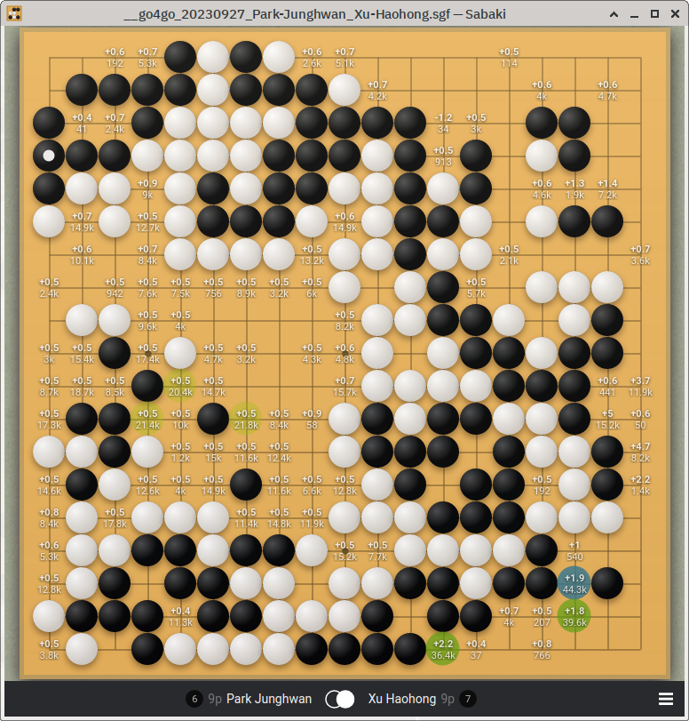
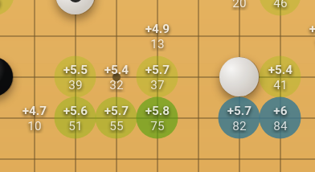
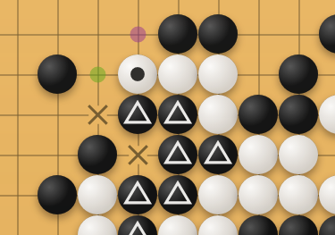

# Agathis theme for Sabaki

A calm theme for [Sabaki](https://sabaki.yichuanshen.de/) with a reduced heatmap to keep you focused.

## Features
- Solid ochre colored board color with no texture. Influenced by goban boards made out of agathis from a renowned korean manufacturer.
- Full size yunzi-style stones. Intended with fuzzy stone placement turned off, but gives a realistic look with fuzzy placement enabled.
- Smaller font size in heatmap.
- Reduced heatmap coloring. From the nine different heatmap levels Sabaki provides by default, only the upper five are used. With blue showing the top move(s) ("AI move") and four shades of green for the remaining levels of good-to-neutral moves (if any).

## Screenshots

## Sources, Influences and other Web Links
- Go stone artwork and background image taken from [Go Themes by ParmuzinAlexander](https://github.com/ParmuzinAlexander/go-themes).
- [Sabaki Issue #789: Help with Some Styling Variables for Themes](https://github.com/SabakiHQ/Sabaki/issues/789)
- [goban.css](https://github.com/SabakiHQ/Shudan/blob/master/css/goban.css) has default style settings for the board.
- [HTML color mixer](https://www.w3schools.com/colors/colors_mixer.asp) for selecting colors and mixing the shades of green for the heatmap.
- [Subdued theme](https://github.com/rooklift/sabaki_subdued_theme_40)

